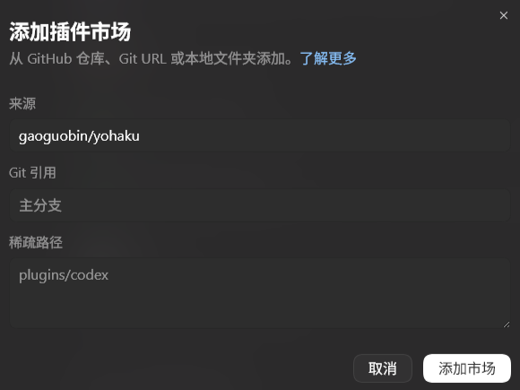
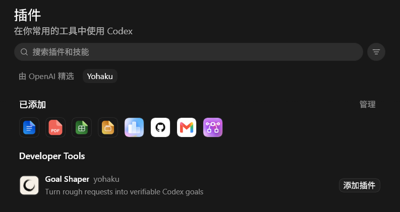
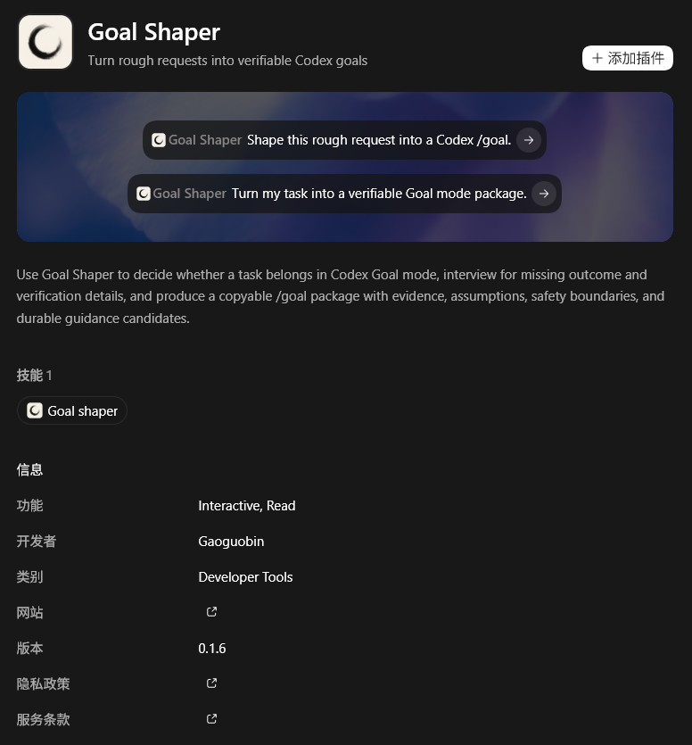
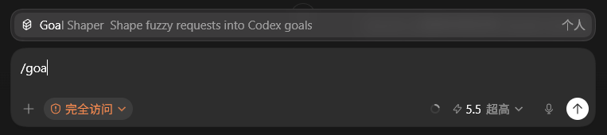
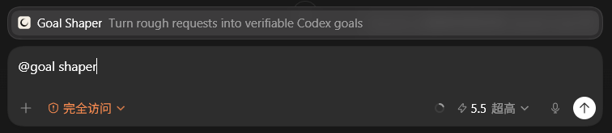
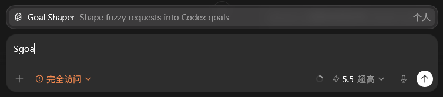

# Yohaku UI ガイド

このガイドは、コマンドラインを使わずに Codex App で操作したいユーザー向け
です。Yohaku マーケットプレイスの追加、Goal Shaper のインストール、入力欄
からの呼び出し方を説明します。

スクリーンショットは画面位置の確認用です。バージョン番号やスターター文言は
現在のリリースと少し異なる場合があります。

## Yohaku マーケットプレイスを追加する

**Plugins** を開き、プラグインマーケットプレイスを追加します。Source には
`gaoguobin/yohaku` を入力します。Git ref と sparse path は、組織から別の値を
指定されていない限り空のままにします。

Yohaku がすぐに表示されない場合は、Codex App を再起動してから **Plugins** を
もう一度開きます。

## Goal Shaper をインストールする

`Yohaku` マーケットプレイスを選択し、**Goal Shaper** を開きます。

詳細ページを開き、**Add to Codex** を選択します。ページ上でバージョン、開発
者、Web サイト、プライバシーポリシー、利用規約を確認できます。スターター
プロンプトの文言はリリースごとに変わることがあるため、インストール済みバー
ジョンの確認には Version を使います。

インストール後は、新しい Codex スレッドを開始してください。

## Goal Shaper を使う

新しいスレッドで、次のいずれかの入口を使います。

### `/` 入口

`/` を入力し、`Goal Shaper` を検索して skill を選択します。

### `@` 入口

`@` を入力し、インストール済みの Goal Shaper プラグイン、またはその中の機能
を選択します。

### `$` で明示的に呼び出す

skill 名が分かっている場合は `$goal-shaper` と入力します。最も明示的な呼び出
し方法です。

## 更新する

Codex App を再起動し、詳細ページでバージョンを確認します。古いバージョンのま
まの場合は、`UPDATE.md` の CLI 更新手順を使います。

## アンインストールする

**Plugins** を開き、インストール済みの Goal Shaper 詳細ページから
**Uninstall plugin** を選択し、新しいスレッドを開始します。`Yohaku` マーケッ
トプレイスは、そこからインストールしたプラグインをすべて使わなくなった場合
だけ削除します。
